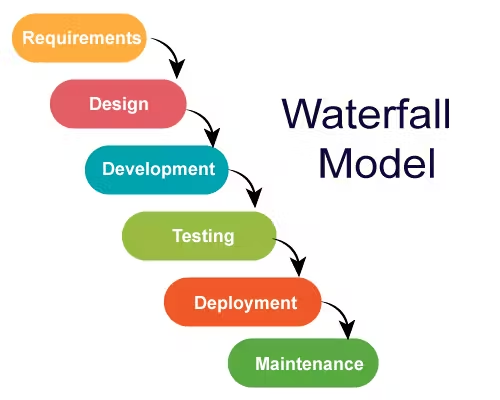
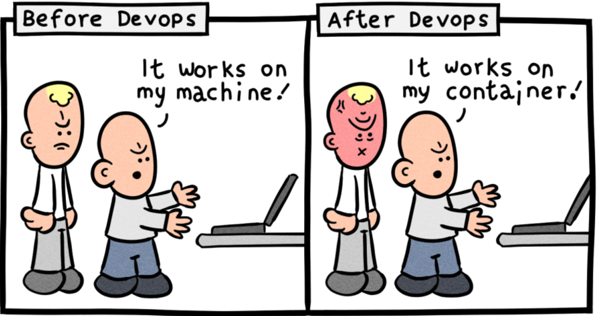

### **Introduction to Your Instructor**

- **DevOps Engineer:** With years of experience in DevOps, I’ve worked with startups and tech teams to build and deploy applications using tools like Kubernetes, AWS, Terraform, and many others.
- **Teaching & Mentoring:** Expirenced in helping pepole become better devops engineers.
- **Working Around the World**
- **Goal for this Course:** My aim is to help you gain practical, industry-relevant DevOps skills and encourage you to learn independently, so you feel confident applying these skills in real-life projects.

---

### **Course Rules and Expectations**

1. **Cameras Are Always Open**
    - Keeping your camera on during sessions helps create a collaborative and engaging environment.
2. **85% Attendance Requirement**
    - You must attend at least **85% of the sessions** to ensure you stay on track and fully benefit from the course.
3. **Submit Projects and Assignments on Time**
    - Deadlines simulate real-world DevOps practices where delivery timelines matter.
4. **Learn on Your Own Too**
    - DevOps is as much about independent learning as guided instruction.
    - Explore, experiment, and dive into resources like documentation, forums, and tutorials beyond what’s taught in class.
    - *"The more you explore, the more confident you’ll become as a DevOps engineer."*

---

### **How to Learn Best from This Course**

### **1. Engage with the System**

- **Self-Discovery**: This system is about diving deeper. I’ll give you the tools and project framework, but it's up to you to research, experiment, and discover additional ways to solve problems.
- **Ask Why and How**: When you complete tasks, don’t just follow steps. Question why each step is necessary and how you could approach it differently.

### **2. Embrace Hands-On Projects**

- **Learning by Doing**: DevOps is hands-on. The projects I assign are designed to make you apply concepts practically. The best way to learn is to tackle these projects as if they were real-world scenarios.
- **Document Your Process**: Keep notes on your challenges, solutions, and what you learned. This will help you retain knowledge and troubleshoot similar issues in the future.

### **3. Explore and Learn Independently**

- **Go Beyond the Course Material**: DevOps is an evolving field. Get comfortable researching new tools, reading documentation, and exploring forums to find answers.
- **Apply Concepts in New Contexts**: Practice setting up a system or solving a problem that’s slightly different from the projects. This will strengthen your understanding and adaptability.

### **4. Participate and Collaborate**

- **Ask Questions**: Your questions can spark great discussions and lead to deeper insights for everyone.
- **Share Your Insights**: Whether you find an interesting tool or learn a new shortcut, sharing will enrich the learning experience for the entire class.

### **5. Keep Up a Growth Mindset**

- **Embrace Challenges**: Learning DevOps means facing challenges and solving new problems independently. Stay curious, patient, and persistent.
- **Reflect and Review**: After each project or lesson, take a moment to review what you’ve learned, what you found challenging, and what you’d do differently next time.

---

- **Definition**: A combination of "Development" and "Operations," DevOps is a cultural and professional movement that emphasizes collaboration between software developers and IT operations.
- **Purpose**: To improve **speed**, **quality**, and **reliability** in delivering software by breaking down traditional barriers between teams.
- **Key Principles**:
    - **Collaboration**: Unites dev and ops teams for shared goals and smooth communication.
    - **Automation**: Automates repetitive tasks to increase efficiency and reduce errors.
    - **Continuous Integration & Deployment (CI/CD)**: Continuously integrates and delivers code changes for faster, incremental releases.
    - **Monitoring & Feedback**: Collects data and insights to continually improve applications and infrastructure.
- **Core Benefits**:
    - **Faster Release Cycles**: Enables quicker delivery of new features and bug fixes.
    - **Improved Reliability**: Reduces the risk of failures through rigorous testing and monitoring.
    - **Enhanced Collaboration**: Creates a culture where developers and operations work together towards common goals.
- **DevOps Practices**:
    - **Infrastructure as Code (IaC)**: Manages infrastructure using code for consistency and scalability.
    - **Configuration Management**: Standardizes environment setup for predictable deployments.
    - **Monitoring & Logging**: Tracks system health and identifies issues proactively.

---

### **What Was Before DevOps?**

- **Traditional Model: Development and Operations Silos**
    - **Separate Teams**: Developers and operations teams worked in isolation with little communication.
    - **Hand-Off Approach**: Developers built the application, then “handed it off” to operations to deploy and manage it.
- **Waterfall Methodology**:
    - **Sequential Phases**: Development followed a linear process with fixed phases—requirements, design, development, testing, and deployment.
    - **Slow Release Cycles**: New features and bug fixes were released in large batches, often taking months (or even years) to go live.
- **Challenges with This Approach**:
    - **Long Development Times**: The lack of feedback loops and slow hand-offs delayed product improvements.
    - **High Failure Rates**: Changes introduced in large releases often led to failures, making it hard to pinpoint and fix issues.
    - **Reactive Problem-Solving**: Issues were usually addressed after deployment, making troubleshooting and resolution slow.
    - **Limited Flexibility**: Developers and operations had fixed roles and responsibilities, limiting collaboration and responsiveness.
- **“Throw it over the wall” Mentality**:
    - Developers would pass completed code to operations without fully understanding the deployment environment, leading to production issues.
    - Operations teams were left to manage and maintain code they hadn’t built, often under high pressure to keep things running smoothly.
    

---

### **Technologies We’ll Use in This Course**

### **1. Python**

- **Purpose**: A versatile programming language used for scripting, automation, and building applications.
- **Why**: Widely used in DevOps for writing scripts, managing configurations, and automating repetitive tasks.

---

### **2. Linux**

- **Purpose**: The primary operating system for servers and DevOps tools.
- **Why**: Knowing Linux is essential, as it powers most servers and cloud environments, providing a robust platform for running applications.

---

### **3. Networking**

- **Purpose**: Understanding network communication and connectivity.
- **Why**: Essential for setting up servers, troubleshooting connections, and managing cloud resources across environments.

---

### **4. Cryptography**

- **Purpose**: Ensuring data security using encryption, hashing, and secure key management.
- **Why**: Critical for protecting sensitive information and implementing secure communication in DevOps processes.

---

### **5. Git**

- **Purpose**: A version control system to track and manage code changes.
- **Why**: Essential for collaboration, Git lets teams work on code together, manage updates, and maintain a history of changes.

---

### **6. Docker**

- **Purpose**: Containerizes applications for portability and consistency across environments.
- **Why**: Allows you to package applications with all dependencies, ensuring they run identically on any system.

---

### **7. Web Servers (Nginx, Apache)**

- **Purpose**: Serve applications and manage traffic efficiently.
- **Why**: Used to host websites and applications, as well as reverse proxies for load balancing.

---

### **8. Jenkins**

- **Purpose**: Automates CI/CD pipelines to streamline code testing, building, and deployment.
- **Why**: Reduces manual work and errors by automating the integration and deployment of code changes.

---

### **9. GitHub Actions**

- **Purpose**: Automates workflows directly in GitHub.
- **Why**: Useful for automating testing, deployments, and other tasks, integrating seamlessly with GitHub repositories.

---

### **10. Kubernetes**

- **Purpose**: Orchestrates and manages containers at scale across a cluster of servers.
- **Why**: Handles deployment, scaling, and self-healing of containerized applications, making it ideal for managing applications in production.

---

### **11. AWS (Amazon Web Services)**

- **Purpose**: A cloud platform offering scalable infrastructure and services.
- **Why**: Provides the foundation for deploying applications in the cloud, including computing, storage, and networking resources.

---

### **12. Terraform**

- **Purpose**: Enables Infrastructure as Code (IaC) to manage infrastructure with code.
- **Why**: Allows for consistent, automated provisioning of cloud resources, reducing setup time and error rates.

---

### **13. Authentication Management**

- **Purpose**: Secures access to applications, infrastructure, and services.
- **Why**: Implements identity and access management to ensure only authorized users and processes can access systems.

---

### **14. GitOps**

- **Purpose**: A methodology to manage infrastructure and deployments using Git as a single source of truth.
- **Why**: Ensures version-controlled, automated, and auditable changes for infrastructure and applications.

---

### **15. Infrastructure as Code (IaC)**

- **Purpose**: Managing and provisioning infrastructure using code.
- **Why**: Simplifies infrastructure management, improves consistency, and accelerates deployments.

---

### **16. Monitoring, Logging, and Alerting (Prometheus, Grafana)**

- **Purpose**: Observing system health, collecting logs, and triggering alerts.
- **Why**: Essential for identifying issues, improving performance, and ensuring reliability in DevOps workflows.

---

### **17. DevOps Methodologies**

- **Purpose**: Frameworks and principles for achieving collaboration and automation.
- **Why**: DevOps is not just about tools but also about processes, culture, and workflows that promote efficiency.

---

### **Course Objectives**

### **1. Master Core DevOps Tools and Practices**

- **Goal**: Become proficient in essential DevOps tools like Docker, Jenkins, Git, Ansible, Terraform, Kubernetes, and AWS.
- **Outcome**: Students will gain hands-on experience with these tools and understand how to use them to automate, configure, and manage applications and infrastructure.

### **2. Build, Deploy, and Monitor Applications in a Cloud Environment**

- **Goal**: Learn to deploy applications on cloud platforms like AWS and manage them effectively using best practices.
- **Outcome**: Students will be able to set up cloud infrastructure, deploy containerized applications, and monitor performance to ensure reliability.

### **3. Develop Strong Scripting and Automation Skills**

- **Goal**: Use scripting languages like Python and configuration tools like Ansible to automate repetitive tasks and streamline workflows.
- **Outcome**: Students will understand how to write effective scripts, automate processes, and configure systems for consistent, scalable performance.

### **4. Implement CI/CD Pipelines for Faster, Reliable Releases**

- **Goal**: Design and build CI/CD pipelines using Jenkins, Git, and other tools to automate testing, building, and deployment.
- **Outcome**: Students will create pipelines that enhance software quality and speed up deployment cycles, reducing errors in the release process.

### **5. Apply Infrastructure as Code (IaC) with Terraform**

- **Goal**: Use Terraform to manage cloud resources with code, making infrastructure setups reproducible and scalable.
- **Outcome**: Students will be able to write Terraform configurations to deploy and manage infrastructure in a cloud environment consistently.

### **6. Build a Portfolio of DevOps Projects**

- **Goal**: Complete hands-on projects and labs that demonstrate skills in deploying, automating, and managing systems.
- **Outcome**: Students will build a portfolio showcasing their ability to work with real-world DevOps tools and practices, which they can share with potential employers.

### **7. Foster Independent Problem-Solving and Self-Learning Skills**

- **Goal**: Encourage students to explore, troubleshoot, and learn independently—a key skill for DevOps professionals.
- **Outcome**: Students will feel confident using documentation, exploring new tools, and solving problems on their own, aligning with industry expectations for DevOps roles.

## Questions ?

